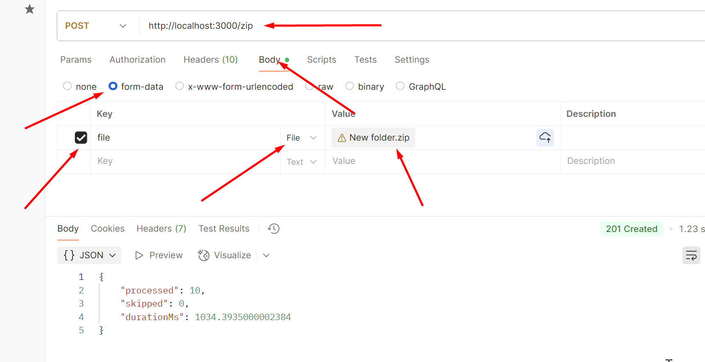

1. Завантажити репозиторій, перейти в папку hw_8.
2. Встановити залежності, npm i.
3. Запустит проект в дев моді, npm run dev.
4. За допомогою Postman вигрузити картинки архівом .zip, отримати відповідь.
5. 